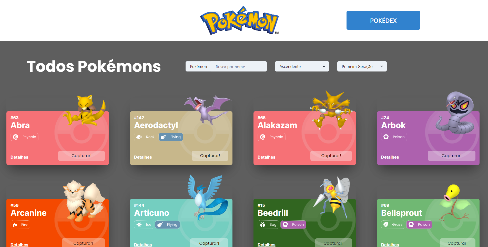
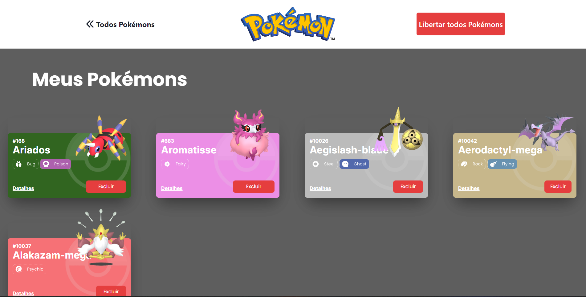
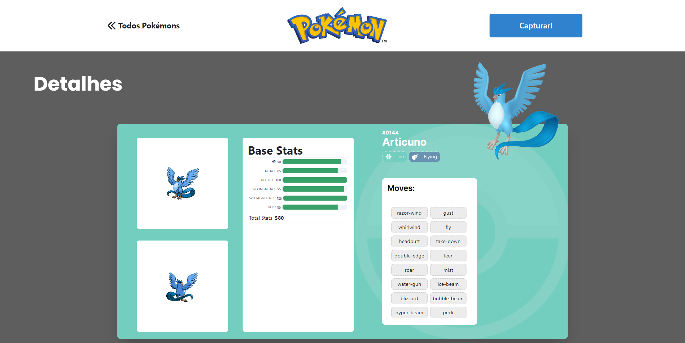
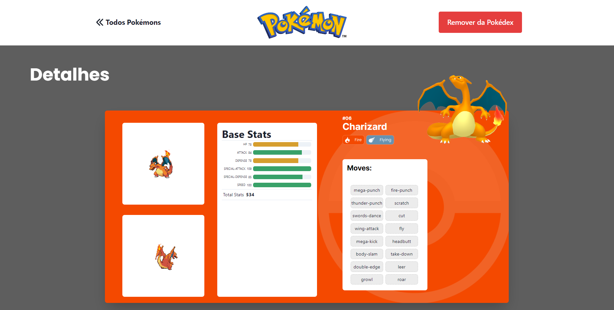

# Projeto React e API's


<br>
Embarque nessa aventura Pokémon, capturando seus pokémons favoritos das nove gerações e seja o maior mestre pokémon de todos. Projeto de finalização do módulo de Front end com utilização do React e suas bibliotecas. na Labenu.

## Índice
- <a href="#funcionalidades">Funcionalidades do Projeto</a>
- <a href="#layout">Layout</a>
- <a href="#rodar">Como rodar esse projeto</a>
- <a href="#tecnologias">Tecnologias utilizadas</a>
- <a href="#autoras">Pessoas autoras</a>
- <a href="#passos">Próximos passos</a>

## Funcionalidades

- [x] Filtro da lista de pokémons por nome
- [x] Ordenação do catálogo por ordem alfabética do nome do pokémon crescente e decrescente
- [x] Ordenação do catálogo por ordem  do nome da nave crescente e decrescente
- [x] Layout da lista de pokémons
- [x] Layout da pokédex dos pokémons capturados
- [x] Layout da página de detalhes dos pokémons com suas habilidades e seus status

## Layout






## Demonstração
[Link Demonstração](https://projeto-react-apis-eta.vercel.app/)

## Como rodar esse projeto

```bash
# Clone esse repositório
$ git clone linkrepo

# Acesse a pasta do projeto no seu terminal
$ cd projeto-react-apis

# Instale as dependências
$ npm install

# Execute a aplicação
$ npm start

# A aplicação será iniciada na porta 3000, acesse pelo navegador:
http://localhost:3000
```

## Tecnologias utilizadas

1. [React](https://reactjs.org/)
2. [React Router](https://reactrouter.com/en/main)
3. [React Context ](https://reactjs.org/docs/context.html)
4. [Axios](https://axios-http.com/ptbr/docs/intro)
5. [Styled-components](https://styled-components.com/)
6. [Chakra-UI](https://chakra-ui.com/)
7. [PokéAPI](https://pokeapi.co/)

## Pessoas Autoras


[Linkedin](https://www.linkedin.com/in/carlos-henrique-de-souza-1767311a/)

## Próximos passos

- [ ] Filtro por ID
- [ ] Filtro por tipo


# **Projeto React e API's**
O Projeto React e APIs é um site de pokémons que possui três páginas: Home, Pokedex e Detalhes. O projeto está subdivido em temas de acordo com os conteúdos que estudado durante o Módulo 2 - Frontend.

Este projeto terá como fonte de dados para a sua criação a [Poke Api](https://pokeapi.co/ "Poke Api"), uma Api pública, muito usada para aplicações focadas em aprendizado de programação e também usada em cases de processos seletivos.

Os conteúdos principais  a serem estudados são:

- Integração de APIs
- React Router
- Design Systems
- Estado Global

## **Enunciado**
É objetivo deste projeto criar um site com três páginas usando a Poke Api com as seguintes ferramentas:

- React
- React Router
- Styled-components
- React Context
- Axios

### **Requisitos**
- **Gerais:**
	- [ ] O site deve ter 3 páginas: Home, Pokedex e Detalhes;
	- [ ] Projeto deve seguir o [design](https://www.figma.com/file/KseyA2Ofghiek2Cy3ZaDre/Poked%C3%A9x?t=AEi3zEmWmarf1FbP-0 "design") proposto;
	- [ ] O fluxo de trocas de páginas devem ser semelhante ao [fluxograma](https://www.figma.com/proto/KseyA2Ofghiek2Cy3ZaDre/Poked%C3%A9x?page-id=0%3A1&node-id=2%3A2&viewport=358%2C197%2C0.27&scaling=scale-down&starting-point-node-id=2%3A2 "fluxograma");
- **Página Home:**
	- [ ]  Mostrar uma lista de Pokemons, contendo ao menos 20 Pokemons;
	- [ ] Cada Pokemon será representado por um Card;
	- [ ] Em cada card de Pokemon tem um botão para adicioná-lo à Pokedex e um outro botão para acessar os detalhes do Pokemon;
	- [ ] Header dessa página terá um botão para acessar a página da Pokedex
- **Página Pokédex**
	- [ ] Renderizar a lista de pokémons adicionados na pokedex;
	- [ ] Em cada card de Pokemon deve ter um botão para removê-lo da Pokedex e um outro botão para acessar os detalhes do Pokemon.
	- [ ] Header deve ter um botão para voltar para a Home
	- [ ] Não deve ser possível adicionar o mesmo Pokemon duas vezes na Pokedex
- **Página de Detalhes**
	- [ ] Mostrar os detalhes do Pokemon selecionado, com informações descritas
	- [ ] Header deve ter um botão para adicionar ou remover da Pokedex e outro para voltar a página home.
- [ ] [Criar um readme](https://www.youtube.com/watch?v=1QKwP0SJK-c "Crie um readme") para o projeto;


### Instruções de entrega

- Faça o fork desse repositório e realize o clone da sua cópia `seu-nome-de-usuario/projeto-intro-web`.
   <details>
   <summary>Quer uma dica?</summary>
   
   </details>
- Crie os arquivos do projeto dentro deste repo;
- Execute o fluxo de entrega do git. **Lembre-se de abrir os PRs para seu próprio repositório.**
- Para isso, você precisará fazer o projeto utilizando **branches**. Evite fazer as alterações direto na branch ```main```
    <details>
       <summary>Dúvidas sobre o Git & Github?</summary>
       <p>Adiciomos um vídeo explicando o <strong>processo de entrega</strong> [do fork ao pull request] no Material Assincrono da <a href="https://classroom.google.com/w/NTM0NjA2NDg3MjIx/tc/NTM2NDg5NTQyODg4">A005 - Git e Github</a>. Esse vídeo também exemplifica situações que podem acontecer durante o fluxo de utilização do Git.</p>
    </details>
- Faça o deploy do projeto. Pode ser ultilizado o surge, Github pages ou outra ferramenta que faça a disponibilização do seu site para acesso público;
				
	dica para usar o surge:
	* Instalar surge (só 1a vez): `npm install -g surge`
	* Buildar app React: `npm run build`
	* Corrigir a nomeação do arquivo (por causa do router)
		 `cp ./build/index.html ./build/200.html`
	* Deployar com surge: `surge ./build`
- Adicionar o link do deploy no readme do seu projeto/repositório:


- Entregue o projeto no [Formulário de entrega](https://docs.google.com/forms/d/e/1FAIpQLSfGGRaglpzWpdREBBfq3eUCMXkRXuiS61Zfyy0L_Ce0uNIXTA/viewform).
